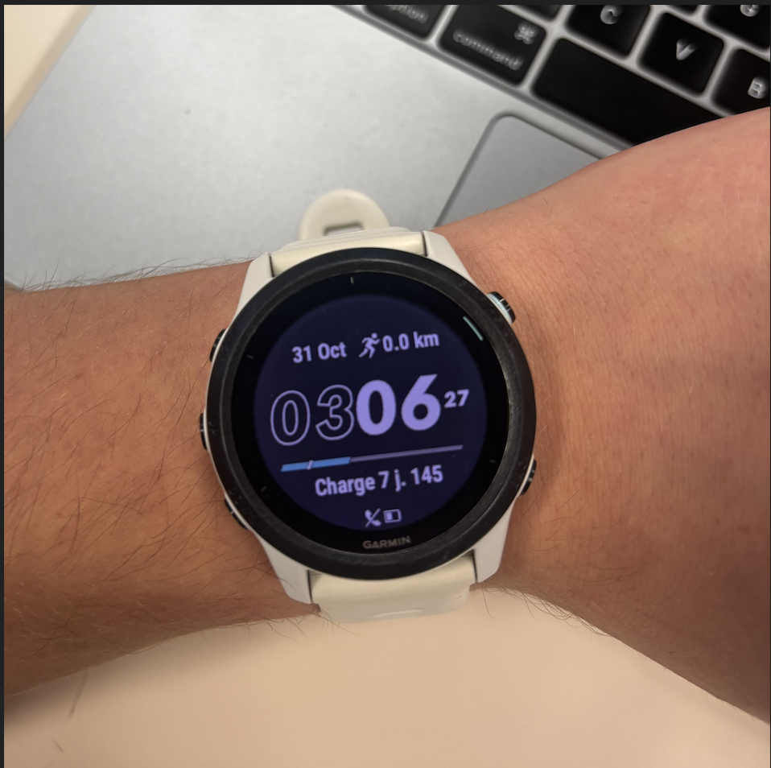
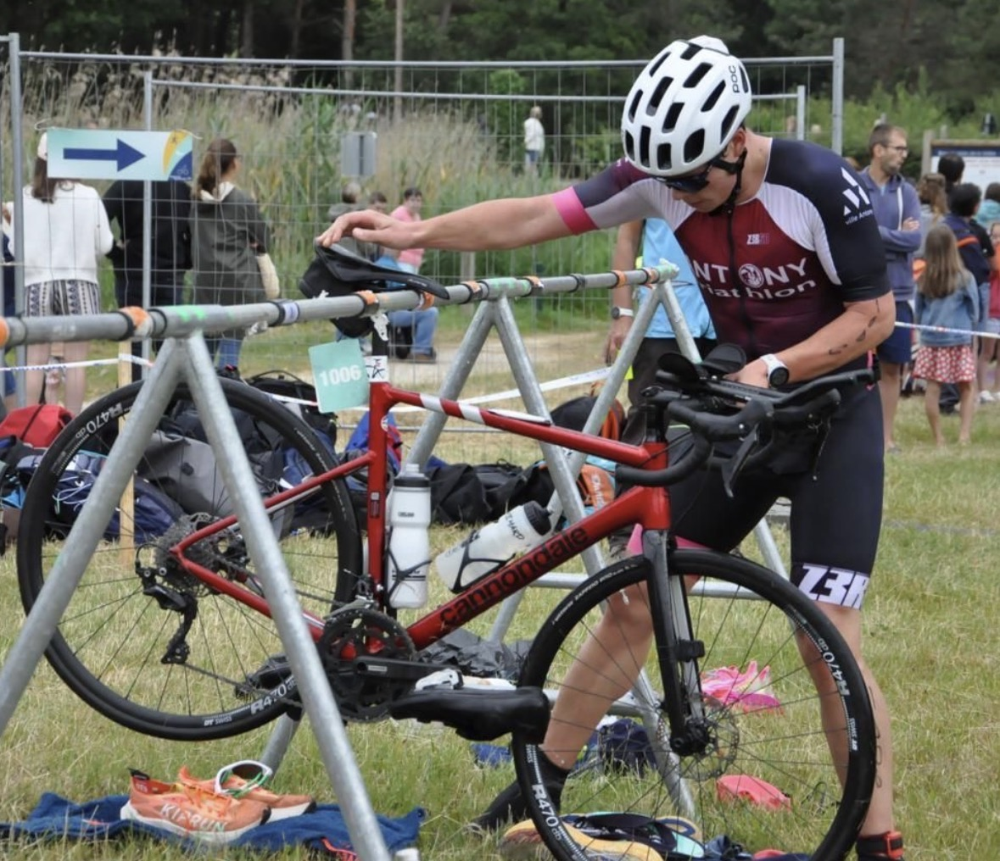

# GarminLoadPredictor
Projet visant à prédire la charge d’entraînement d’un individu et à prévenir les blessures ainsi que la fatigue, en s’appuyant sur les données collectées par une montre Garmin.

---

## 🦾 Projet Machine Learning : Détection de Surcharge et de Surmenage

### ❓ Problématique

Ce projet vise à répondre à la question suivante :

> **Peut-on prédire les jours où le corps est en état de fatigue excessive (surcharge/surmenage) à partir des données de charge d’entraînement et de récupération fournies par une montre connectée Garmin ?**

Nous cherchons à **détecter automatiquement** les situations de **surmenage** (ou *overtraining*) chez un individu en utilisant des données physiologiques et comportementales collectées de manière quasi quotidienne.

---

### 🎯 Objectif et Définition du Surmenage

L'objectif principal est de développer un modèle de **classification binaire supervisée** pour prédire un **risque de surmenage** basé sur les données de l'utilisateur.

Le **surmenage** est défini dans ce cadre comme un état où la **charge d’entraînement devient excessive** et la **récupération est insuffisante**. Cela se manifeste par une fatigue accrue, une baisse potentielle des performances et un stress physiologique élevé.

#### Variable Cible (Output)

La variable à prédire est $\text{overtraining\_risk}$ (indicateur binaire) :

| Valeur | Interprétation |
| :---: | :--- |
| **0** | **Pas de surmenage** (récupération suffisante, charge modérée) |
| **1** | **Risque de surmenage** (fatigue, manque de récupération, stress élevé) |

> **⚠️ Limite :** En l'absence d'un diagnostic médical réel, la variable cible $\text{overtraining\_risk}$ est une **variable artificielle** construite via une **heuristique** (règles basées sur les données : stress élevé, faible sommeil, activités fréquentes, etc.). Elle sert à tester la faisabilité du modèle.

---

### 📊 Données d'Entrée

Les données sont issues de l'API de Garmin de l'utilisateur sur une période d'environ deux ans et sont séparées en deux catégories :

#### 1. Données Physiologiques (Suivi Quotidien)

Résumé quotidien des métriques de santé et de bien-être, incluant des variables clés pour la détection de la fatigue :

* **Fréquence Cardiaque :** $\text{minHeartRate}$, $\text{restingHeartRate}$, $\text{lastSevenDaysAvgRestingHeartRate}$
* **Stress et Récupération :** $\text{averageStressLevel}$, $\text{maxStressLevel}$, $\text{bodyBatteryChargedValue}$, $\text{bodyBatteryDrainedValue}$, $\text{bodyBatteryMostRecentValue}$
* **Sommeil et VFC :** $\text{sleepHours}$, $\text{hrvValue}$ (*Heart Rate Variability*), $\text{avgWakingRespirationValue}$
* **Activité Quotidienne :** $\text{totalSteps}$, $\text{totalDistanceMeters}$

#### 2. Données d’Activité (Séances Sportives)

Détails des séances sportives enregistrées :

* $\text{activityType}$ (course, vélo, natation, etc.)
* $\text{distance}$ et $\text{duration}$
* $\text{averageHR}$ et $\text{maxHR}$

---

### 🛠️ Structure du Notebook (Pipeline Machine Learning)

Le projet est organisé autour des deux grandes étapes suivantes dans le notebook :

#### 1. Formalisation du Problème

* Pose du cadre théorique et définition formelle du problème de classification.
* Justification de la construction de la variable cible heuristique.

#### 2. Pipeline Machine Learning

Cette section couvre les étapes pratiques de l'analyse et de la modélisation :

* **Récupération et Analyse des Données**
    * Acquisition des données via l'API Garmin et fusion des fichiers CSV.
    * Statistiques descriptives et visualisation des distributions (stress, sommeil, pas) .
    * Analyse des corrélations entre les variables (e.g., corrélation entre VFC et stress).
* **Préparation des Données**
    * Nettoyage (gestion des valeurs manquantes et des erreurs).
    * Sélection des variables pertinentes ($\mathbf{X}$).
    * Construction de la **variable cible** $\text{overtraining\_risk}$ (heuristique).
* **Sélection d'un Modèle de Base**
    * Définition de la métrique de performance (e.g., F1-Score, Recall).
    * Entraînement et évaluation d'un premier modèle de classification comme **modèle de référence**. 

---

### 💻 Technologies Utilisées

* **Langage :** Python
* **Librairies :** Pandas, NumPy, Scikit-learn, Matplotlib, Seaborn
* **Source de Données :** API Garmin Connect

---

### 🖼️ Image de garmin et vélo !

Voici les deux balises d'image à insérer dans votre notebook/documentation :

1.  
2.  

---

Puis-je vous aider à rédiger le plan détaillé pour la section **2. Pipeline Machine Learning** ou à commencer le code Python pour la récupération des données ?